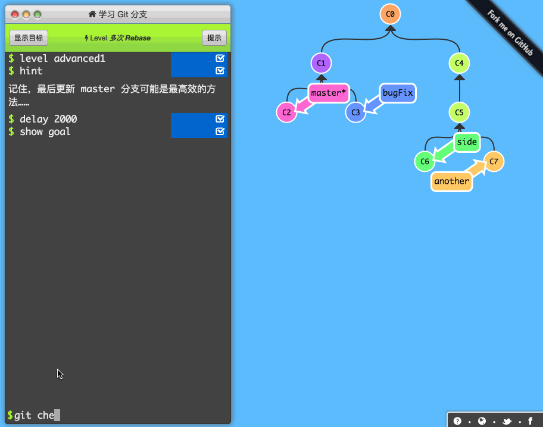

# rebase
- [reference](https://www.cnblogs.com/ludashi/p/8116434.html)

## 简介
rebase 操作和 merge 操作最终都可以达到合并代码的效果，不过其对分支的影响不同。上篇博客中我们聊到了 merge操作。简单的说merge操作就是将两个commit进行合并，然后在这两个分支合并的基础上创建一个新的commit。而变基操作简单的说是改变提交的父类，在改变父类时进行合并操作。合并就可能产生冲突，所以rebase时也会产生冲突，下方会介绍到。

## sample
-   

```
git checkout  side
git rebase master
git checkout master
git merge side
```