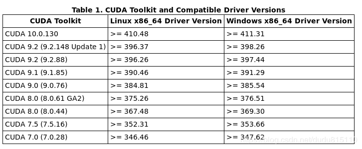

# nvidia
- lspci | grep NVIDIA 查看显卡驱动
    - 03:00.0 VGA compatible controller: NVIDIA Corporation GM206 [GeForce GTX 960] (rev a1)
- sudo apt-get install gcc-6 g++-6 linux-headers-$(uname -r) nvidia-384 -y
- [CUDA，NVIDIA Driver，Linux，GCC之间的版本对应关系表格](https://blog.csdn.net/dudu815110/article/details/87167518)

- 不推荐 https://www.nvidia.com/Download/index.aspx?lang=en-us 查询硬件最新驱动 直接在官网下载 *.run文件
    - chomd +x *.run
    - sudo ./*.run 
- 安装NVIDIA驱动（推荐使用）
    - 添加源
        - sudo add-apt-repository ppa:graphics-drivers/ppa
        - sudo apt update
        - sudo apt upgrade
    - ubuntu-drivers devices 查看硬件
    - sudo apt install 特定版本就可以，如果有unmet dependencies，则需要考虑进行一个一个安装

